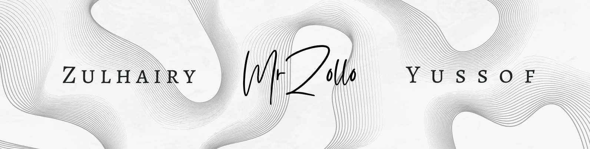

  

  

# Hi there, I'm MrZollo 👋 

🎓 **Student in Information Technology**  
🚀 **Passionate PHP Developer — Laravel Enthusiast**  
💻 **VSCode Power User**

---

## 👨‍💻 About Me

- I’m currently a student specializing in IT, with a strong passion for building solutions that matter.
- My main stack: **PHP** (Laravel is my go-to framework!)
- I love developing practical tools—everything from café management apps to robust e-commerce solutions.
- My favorite project? **Analysis Sistem For Malaysian Prison** — my final year project, and a real highlight of my learning journey.

---

## 🌱 What I Love

- Creating tools that make life easier for others.
- Exploring new ways to solve real-world problems with code.
- Collaborating and learning with the tech community.

---

## 📌 Featured Project

### 🏆 Prisoner Record and information System management
A comprehensive analysis solution designed to support the Malaysian prison system.  
*Built with PHP & Laravel.*

---

## 🛠️ Tech Stack

---

## 📫 Connect with Me

Find my social links on [my GitHub profile](https://github.com/MrZollo) — let’s connect!

---

## 💡 Favorite Quote

> "Never say die before you try."

---

Thanks for visiting my profile!  
Feel free to check out my repositories or reach out for collaboration 🚀
